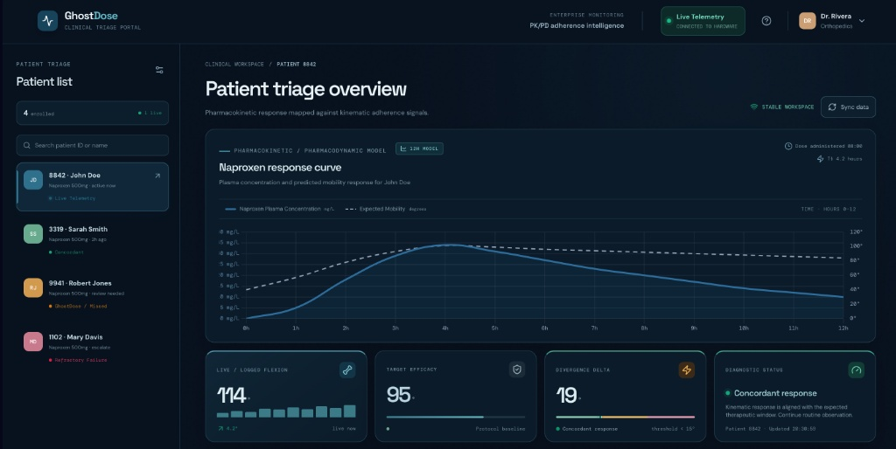
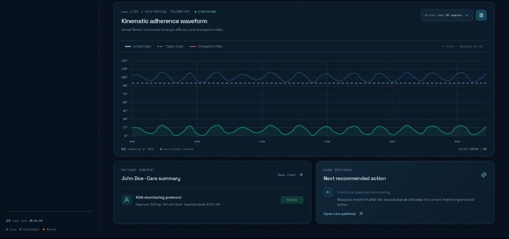
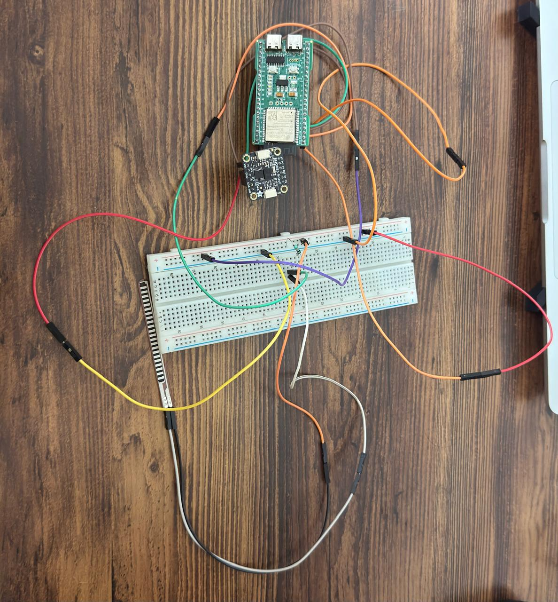

# GhostDose: The Divergence Engine

GhostDose is a wearable MedTech prototype designed to track patient adherence to osteoarthritis (KOA) drug protocols. Using an ESP32-S3, a BNO085 IMU, and a flex sensor, the device runs edge-processing algorithms to translate raw physical movement into clinical metrics. By comparing live kinematic data—such as patellar flexion and heel-strike cadence—against expected pharmacokinetic response curves, GhostDose's "Divergence Engine" automatically alerts clinicians when a patient misses a dose or fails to respond to treatment.

## The Hardware Stack
* **Microcontroller:** ESP32-S3 (Edge processing & I2C management on pins 5/6)
* **Kinematics:** Adafruit BNO085 9-DoF IMU (Hardware-accelerated linear acceleration for gait tracking)
* **Flexion Tracking:** 10kΩ Voltage Divider Flex Sensor circuit

## Edge Processing Logic (The Divergence Engine)
Instead of streaming raw analog voltages, the ESP32-S3 performs local edge-computing:
1. **Calibration:** Maps raw ADC voltage to 0°-135° knee flexion.
2. **Gait Analysis:** Calculates 3D vector magnitude ($Magnitude = \sqrt{X^2 + Y^2 + Z^2}$) from the IMU to isolate heel strikes.
3. **Delta Calculation:** Continuously subtracts the patient's actual mobility from a hardcoded baseline "Expected Target" (simulating a Naproxen PK/PD efficacy curve) to calculate the Residual Delta.

## Enterprise Web Dashboard (Prototype)
While the core Divergence Engine runs locally on the ESP32-S3 via Serial Plotter for real-time edge testing, this repository also includes a comprehensive UI/UX prototype for the scalable clinical triage portal. 
* Open `index.html` in any web browser to view the multi-patient PK/PD simulator.
* The dashboard visualizes the theoretical Naproxen response curve mapped against kinematic adherence signals, demonstrating the intended cloud-deployed software architecture.

## How to Run the Demo
1. Flash `GhostDose_Firmware.ino` to an ESP32-S3 via the Arduino IDE.
2. Install the `Adafruit BNO08x` and `Adafruit Unified Sensor` libraries.
3. Open **Tools > Serial Plotter** at 115200 baud to view the live clinical waveform.
4. Open `index.html` in Chrome/Safari to view the enterprise clinical UI prototype.

### Live Telemetry Demo
*(Add your plotter_demo.png screenshot here)*

### Web Portal Prototype

### Hardware Setup

